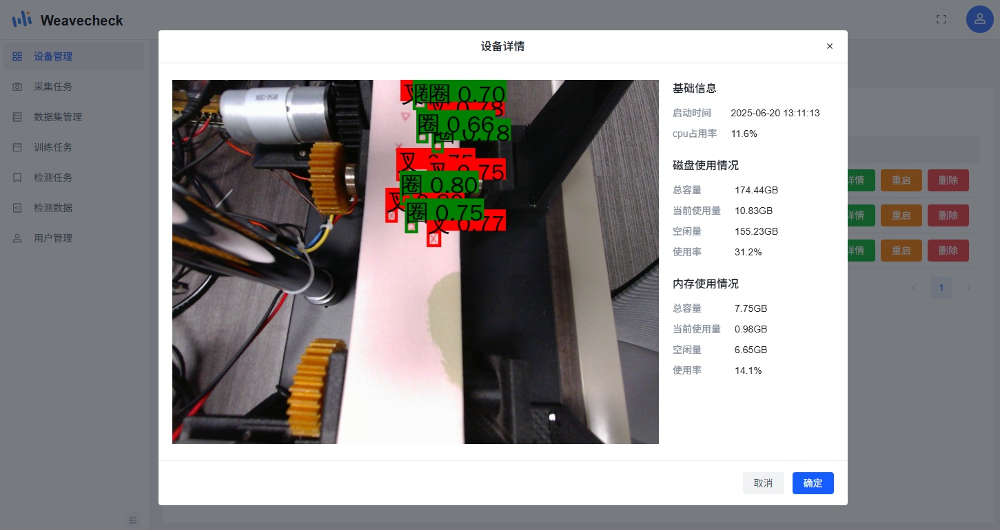
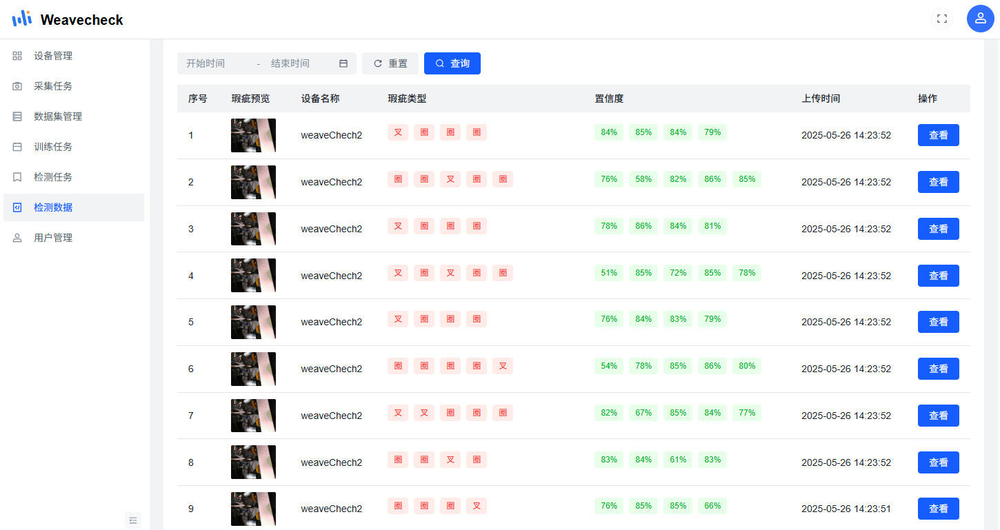

# RKYOLO Edge

<div align="center"></div>

<h1 align="center">亿语智能视觉检测平台</h1>

本项目是一款专为 RK3588 边缘计算平台优化的 AI 视觉处理解决方案，深度集成 YOLO 系列目标检测技术，支持 Yolov5、Yolov8 及最新的 Yolov11 模型。系统兼容海康威视 MVS USB 摄像头与 UVC 协议摄像头，可广泛应用于工业检测、智能安防、智慧交通等需要本地化实时处理的场景。

## 功能特点

- ✅ RK3588 平台深度优化
- ✅ YOLO 技术深度集成
- ✅ 极致边缘计算性能
- ✅ 高精度识别
- ✅ 多摄像头兼容设计
- ✅ 开发友好
- ✅ 跨平台 PC、手机端、平板
- ✅ 开源版本支持免费商用

## 优势

```
1. NPU 硬件加速，针对 RK3588 内置的 NPU 进行模型量化与推理优化，相比纯 CPU 方案性能提升 8 倍以上，功耗降低 60%
2. YOLO 技术深度集成，内置 Yolov5、Yolov8、Yolov11 三种主流模型，支持一键切换，满足不同场景下精度与速度的平衡需求，提供基于 RK3588 平台的量化感知训练工具，支持使用自有数据集进行模型微调
3. 多摄像头兼容设计，同时支持海康威视 MVS USB 工业摄像头与标准 UVC 协议摄像头，无需修改代码即可切换
4. 可视化调试工具，内置模型性能分析工具，实时显示 NPU 利用率、帧率、内存占用等关键指标
5. 实时处理能力，在 RK3588 NPU 上，Yolov8 模型可实现 640×640 分辨率下 60FPS 的实时检测
6. 高精度识别，针对工业场景常见的小目标问题，通过特征融合与注意力机制优化，对直径 5mm 以下目标的检测召回率提升至 92%
```

### 🔥 低成本高价值方案

| 方案                | 硬件成本  | 开发周期 | 维护难度 |
| ------------------- | --------- | -------- | -------- |
| 传统 GPU 服务器方案 | 15,000 元 | 2-4 周   | 高       |
| 亿语智能视觉检测    | 2,000 元  | 1-3 天   | 极低     |

**适合用户**

- 预算有限的个人开发者、创业团队；
- 寻求低成本自动化检测的中小型制造企业；
- 对数据本地化有需求的敏感行业。

## 项目预览

[平台预览](https://demo.eyuai.com/vd_front/login) （有关本项目的使用说明，请参考 [平台使用说明](./readme/readme.md) 。\* 平台演示以布匹检测为例 )

### 项目截图


---



---



---

## 手机端 APP

- [下载地址](https://pan.baidu.com/s/1USdV5GuBHhKyz-LGHaeBIg?pwd=v29h) (提取码：v29h)

## 使用许可和与商业合作

### 1. 个人开发者免费政策

个人用户可免费使用本项目提供的平台进行测试与模型训练

### 2. 商业合作方案

针对企业用户和商业项目，我们提供灵活的合作模式：

- 定制开发服务：根据具体业务场景需求，提供模型定制训练与系统深度优化服务
- 联合研发合作：与行业合作伙伴共同开发专用视觉识别解决方案，共享知识产权
- 技术支持包：提供 7×24 小时专家技术支持，包括模型调优、系统部署与故障排除
- 硬件集成方案：提供 RK3588 开发板 + 视觉识别系统的整体硬件解决方案

## 联系方式

如果有技术问题需要讨论交流，又或者需要定制开发与技术支持，欢迎加入以下群：

(亿语智能视觉检测官方群二维码)

<!-- <table>
  <tr>
    <td>
      
    </td>
  </tr>
</table> -->

## 安装步骤(板端)

`letter_box`使用 pybind 实现，所以需要在 `src/letter_box_neon` 中编译`letter_box_neon.so`

```shell
cd src/letter_box_neon
mkdir build
cmake ..
make
cp letter_box_neon.so ../../..
```

运行安装脚本：

```bash
sudo ./install.sh
```

## 启动服务

```bash
sudo systemctl start camera-detector
sudo systemctl enable camera-detector
```

## 其他

模型更新删除启用等等操作需要在云平台上，也可以自行开发 mqtt 控制服务。

以下是模型的`config.json`文件格式：

```json
{
  "model_id": "2762e899-e084-45f0-ab56-dd2ed683b271",
  "sha256": "6e3c79dafa2ee732623a38cb1112877c31716242db6f00ad506c83521b11e60f",
  "name": "best.rknn",
  "model_type": "yolov8",
  "model_task": "detect",
  "version": "1",
  "classes": ["1", "2"],
  "img_size": [640, 640]
}
```

如果是 yolov5, 还需要`anchors`字段。
