# WeaveCheck 检测系统使用文档

## 一、文档说明

### 1.1 系统定位

本手册旨在为用户提供 WeaveCheck 检测系统的详细使用指南，帮助用户快速熟悉系统功能、操作流程及相关注意事项，确保用户能够高效、准确地使用本系统完成各项业务操作。

### 1.2 配套代码地址

- **github 仓库地址**：`https://github.com/eyuai/RKYOLO-Edge`
- **推荐环境**：
  - 浏览器：Chrome 90+ / Edge 100+（支持极速模式）
  - 分辨率：1920×1080 及以上
  - 网络：建议使用有线网络，上传图片需 ≥2Mbps 带宽

### 1.3 整套操作流程

```
1.在设备管理页面绑定设备。
2.在数据集管理页面创建新的数据集。
3.在采集任务页面添加采集任务，并手动标注图片，标注完成后上传至对应数据集。
4.通过对应的数据集，创建相关训练任务。
5.添加检测任务，当需要检测时开始任务，不需要时结束任务。
6.检测到的结果可以在检测数据中查看。
```

## 二、登录与退出操作指南

### 2.1 登录流程（详细步骤）

#### 步骤 1：进入登录页面

打开浏览器，输入系统 URL 并回车，显示如下登录界面：

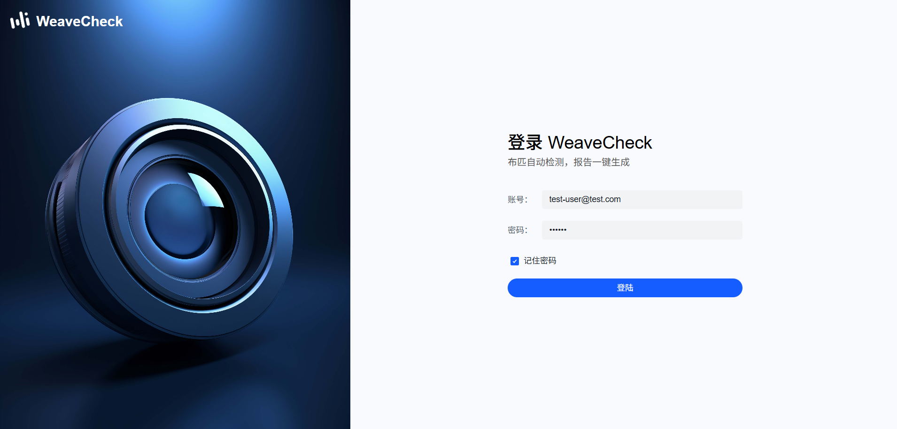

#### 步骤 2：填写登录信息

- **账号输入**：在「账号」输入框中填写账号
- **密码输入**：在「密码」输入框中填写密码
- **记住密码**：
  - 勾选：系统将保存账号信息至本地浏览器（仅限个人设备使用）
  - 不勾选：每次登录需手动输入账号密码

| 用户名             | 密码   |
| ------------------ | ------ |
| test-user@test.com | 123456 |

#### 步骤 3：完成登录验证

- 点击「登录」按钮后，系统执行验证：校验账号密码正确性，跳转对应界面

### 2.2 安全退出

- **操作路径**：  
  页面右上角点击「头像图标」→ 选择「退出登录」
- **效果**：
  1. 清除浏览器缓存的会话信息
  2. 强制跳转至登录页面
  3. 下次登录需重新验证身份

## 三、添加检测设备

### 3.1 新增设备

#### 步骤 1：进入设备管理页面

登录后默认进入「设备管理」页面，或通过左侧导航栏选择：  
「设备管理」→「新增设备」

当前页面中可显示已添加的设备，或对已经添加的设备进行操作。

#### 步骤 2：添加设备

- **设备名称**：输入框中填写设备的名称
- **设备序列号**：在输入框中填入设备的序列号
- **设备模型（可选）**：
  - 未选择数据模型：无数据模型
  - 已选择数据模型：选中对应的数据模型

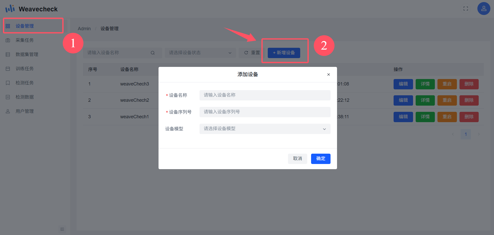

### 3.2 操作设备

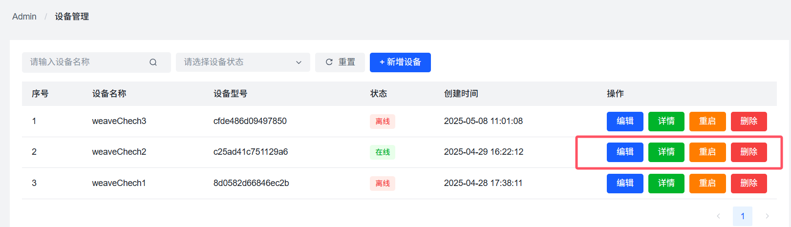

#### 3.2.1 编辑设备

点击设备栏中操作下的蓝色编辑按钮，可以通过变更输入框中的内容，更改设备的名称、序列号和设备模型。

#### 3.2.2 设备详情

点击设备栏中操作下的绿色详情按钮，可以弹出设备详情弹框，可以查看设备的基础信息、磁盘使用情况和内存使用情况。点击左侧的授权拉流按钮并进行授权操作（跳转外部网页成功访问后关闭，回到当前页面重新打开），即可查看当前设备的事实预览情况。

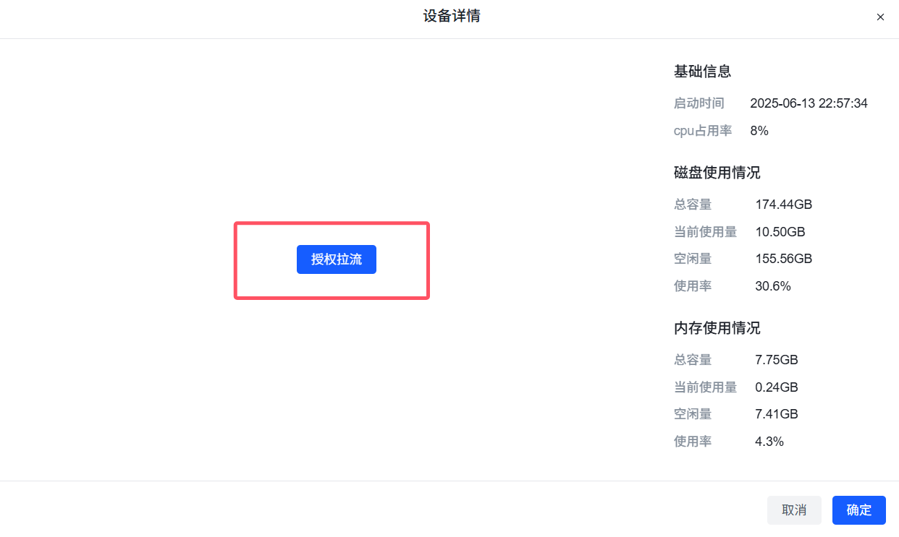

#### 3.2.3 重启设备

点击设备栏中操作下的橙色重启按钮，即可重启设备。

#### 3.2.4 删除设备

点击设备栏中操作下的红色删除按钮，即可删除设备。

## 四、采集任务

### 4.1 添加任务

#### 步骤 1：进入采集任务页面

通过左侧导航栏进入采集任务页面，选择： 「采集任务」→「添加任务」

#### 步骤 2：添加任务

- **任务名称**：输入框中填写任务的名称
- **任务描述**：在输入框中填入任务的描述
- **关联设备**：选择任务需要关联的设备名称

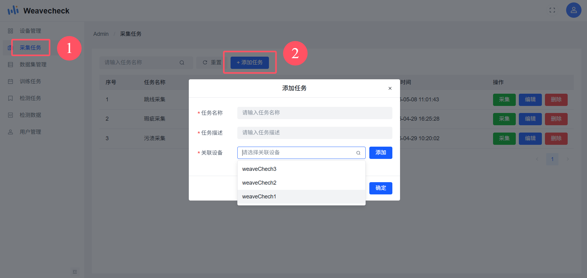

### 4.2 任务操作

#### 4.2.1 图片采集

点击操作下的绿色采集按钮，即可跳转采集图片页面。通过左侧的实时预览画面，点击采集图片按钮截取到你需要的图片，显示在下方列表中。

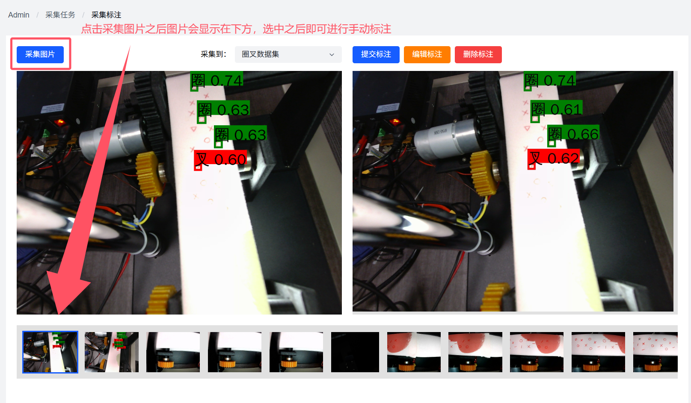

1. **提交标注**：选中下方列表中你采集到的图片进行标注，当标注完成后，点击提交标注按钮，将图片提交到对应的数据集当中。
2. **编辑标注**：选中一个你未提交图片中的标注，进行标注编辑修改。
3. **删除标注**：删除一个你当前选中的标注。

#### 4.2.2 任务编辑

点击任务栏中操作下的蓝色编辑按钮，可以通过变更输入框中的内容，更改任务的名称、描述和关联设备。

#### 4.2.3 任务删除

点击任务栏中操作下的红色删除按钮，即可删除任务。

## 五、数据集管理

### 5.1 添加数据集

#### 步骤 1：进入数据集管理页面

通过左侧导航栏进入数据集管理页面，选择： 「数据集管理」→「添加数据集」

#### 步骤 2：添加数据集

- **名称**：输入框中填写数据集的名称
- **数据集类型**：在输入框中填入数据集的类型
- **描述**：选择数据集的描述

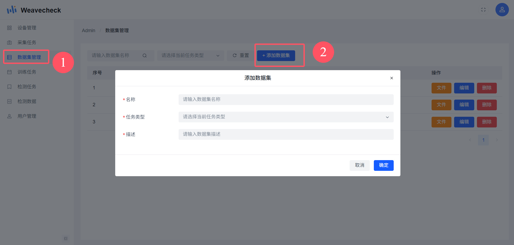

### 5.2 数据集管理操作

#### 5.2.1 文件管理

点击操作下的橙色文件按钮，即可跳转文件管理页面。通过设备采集到的图片都会显示在这里。

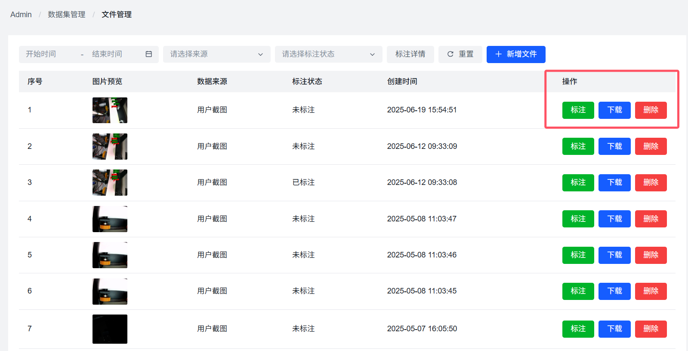

1. **标注**：点击操作下绿色标记按钮，可以对选中的图片进行提交标注、编辑标注和删除标注等操作。
2. **下载**：点击操作下蓝色下载按钮，可以下载选择图片至本地。
3. **删除**：删除当前选中的图片。

#### 5.2.2 任务编辑

点击任务栏中操作下的蓝色编辑按钮，可以通过变更输入框中的内容，更改任务的名称、描述和关联设备。

#### 5.2.3 任务删除

点击任务栏中操作下的红色删除按钮，即可删除任务。

## 六、训练任务

### 6.1 创建训练任务

#### 步骤 1：进入训练任务页面

通过左侧导航栏进入训练任务页面，选择： 「训练任务」→「创建任务」

#### 步骤 2：创建任务

点击界面中蓝色创建任务按钮，可以弹出创建任务弹框，进行对应的操作即可创建任务。

1. **数据集选择**：选择训练所需要的数据集（若没有创建数据集，请点击跳转新建数据集）。
2. **任务信息**：填入训练任务名称、描述、类型和任务算法。
3. **训练配置**：填入需要训练的次数和训练图片数。

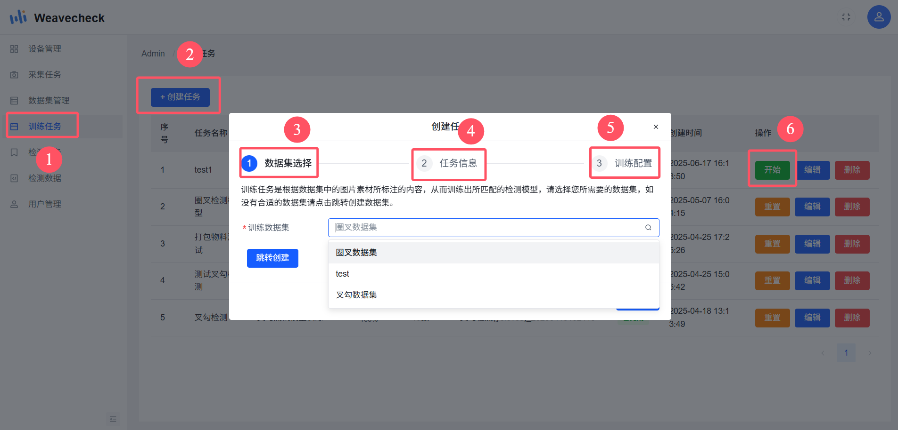

### 6.2 训练任务操作

#### 6.2.1 开始训练

当成功创建任务后，需要点击操作中开始按钮，开始训练任务，等待一段时间后即可训练完成（预计耗时 2-4 小时）。

#### 6.2.2 重置训练

点击操作中重置按钮，即可重置训练任务。

#### 6.2.3 编辑训练

点击操作中编辑按钮，可以通过变更输入框中的内容，更改训练数据集、训练次数和训练图片数。

#### 6.2.4 删除训练

点击操作中删除按钮，即可删除训练任务。

## 七、检测任务

### 7.1 添加检测任务

#### 步骤 1：进入检测任务页面

通过左侧导航栏进入检测任务页面，选择： 「检测任务」→「添加任务」

#### 步骤 2：创建任务

点击界面中蓝色添加任务按钮，可以弹出添加任务弹框，进行对应的操作即可创建任务。

1. **任务名称**：输入创建任务的名称。
2. **任务描述**：输入创建任务的描述。
3. **关联设备**：选择任务需要关联的设备。

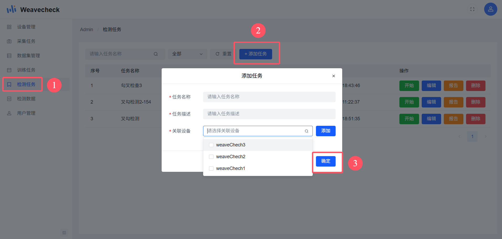

### 7.2 检测任务操作

#### 7.2.1 开始检测

当成功创建任务后，点击操作中开始按钮，即可开始检测。

#### 7.2.2 编辑检测

点击操作中编辑按钮，即可编辑任务的名称、描述和关联设备。

#### 7.2.3 检测报告

点击操作中报告按钮，即可查看检测出的报告信息。

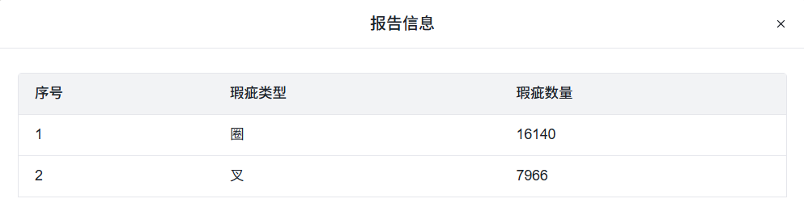

#### 7.2.4 删除检测

点击操作中删除按钮，即可删除检测任务。

## 七、检测数据

检测任务开启后采集到的图片都会显示在这里，可以查看相关的瑕疵类型、置信度、上传时间和瑕疵位置等信息。

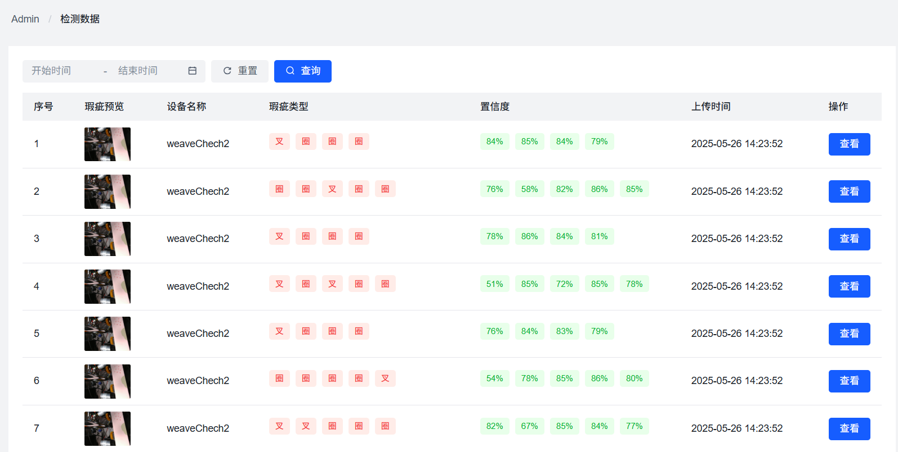
